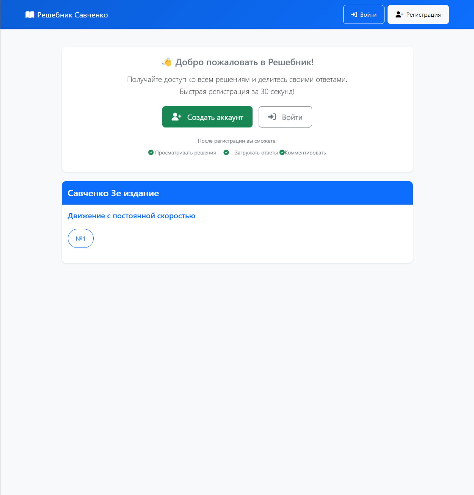
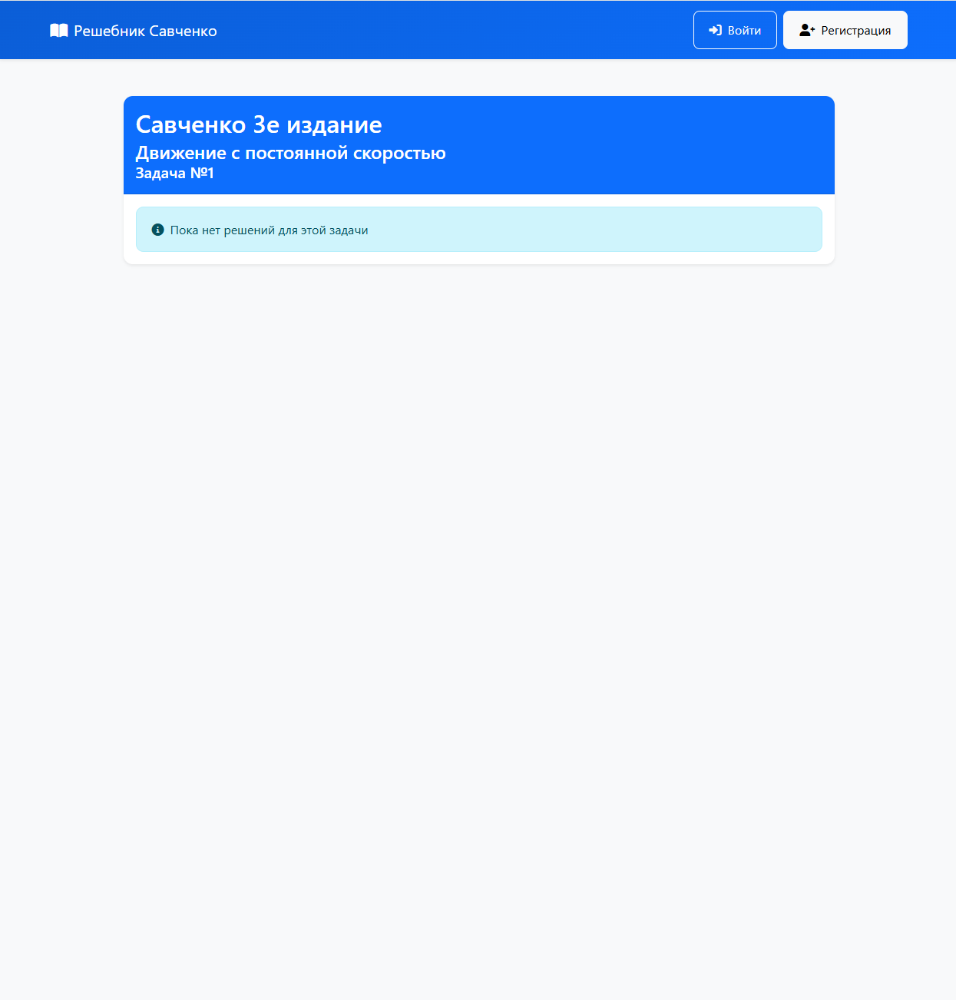
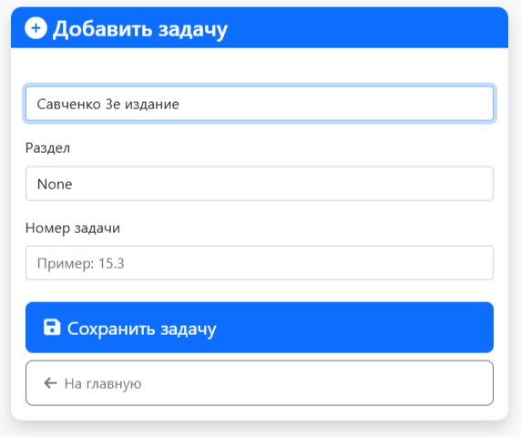

# 📚 Решебник Савченко

**Решебник Савченко** — это удобная онлайн-платформа для просмотра и добавления решений задач из учебника Савченко. Проект разработан для учащихся и преподавателей, чтобы упростить процесс обучения и обмена знаниями.

---

## ✨ Основные возможности

- **📖 Просмотр решений**: Найдите решения задач по классу, разделу и номеру.
- **📸 Загрузка решений**: Добавляйте свои решения в виде изображений.
- **🔐 Регистрация и авторизация**: Создайте аккаунт, чтобы получить доступ ко всем функциям.
- **📱 Адаптивный дизайн**: Удобное использование на любых устройствах.

---

## 🚀 Как начать?

### 1. Установка и запуск

1. Убедитесь, что у вас установлены [Docker](https://www.docker.com/) и [Docker Compose](https://docs.docker.com/compose/install/).
2. Клонируйте репозиторий:
   ```bash
   git clone https://github.com/Laajf/savchenko.git
   cd for_savchenko
   ```
3. Запустите проект:
   ```bash
   docker-compose build --no-cache
   docker-compose up
   ```
4. Откройте браузер и перейдите по адресу: [http://localhost:8000](http://localhost:8000).

---

### 2. Использование

- **Главная страница**: Выберите класс, раздел и номер задачи.
- **Просмотр решений**: Нажмите на номер задачи, чтобы увидеть решения.
- **Добавление решений**: Авторизуйтесь и загрузите свои решения в виде изображений.

---

## 🛠 Технологии

- **Backend**: FastAPI, SQLAlchemy
- **Frontend**: Jinja2, Bootstrap
- **База данных**: SQLite
- **Контейнеризация**: Docker, Docker Compose

---

## 📂 Структура проекта

```
for_savchenko/
├── static/               # Статические файлы (CSS, изображения)
│   └── uploads/          # Загруженные решения
├── templates/            # HTML шаблоны
├── database.py           # Модели и настройка БД
├── main.py               # Основной файл приложения
├── Dockerfile            # Конфигурация Docker
├── docker-compose.yml    # Конфигурация Docker Compose
├── requirements.txt      # Зависимости Python
└── README.md             # Этот файл
```

---

## 🖼️ Скриншоты

### Главная страница


### Страница задачи


### Форма добавления решения


---

## 🤝 Как помочь проекту?

1. Сообщайте об ошибках через [Issues](https://github.com/ваш-репозиторий/for_savchenko/issues).
2. Предлагайте улучшения через Pull Requests.
3. Расскажите о проекте друзьям и коллегам!

---

## 📜 Лицензия

Этот проект распространяется под лицензией MIT. Подробности см. в файле [LICENSE](LICENSE).

---

## 📞 Контакты

Если у вас есть вопросы или предложения, свяжитесь с автором проекта:

- **Email**: crymov.artyom@yandex.ru
- **GitHub**: https://github.com/Laajf

---

**Спасибо, что используете Решебник Савченко!** 🎉
